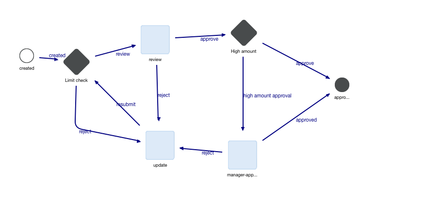

# Kaleo Forms example how to use Rest Consumer

This directory contains workflow



DDM structure for this is ```ddm-withdrawal-kaleo-form.xml``` and edit templates at ```ddm-templates``` directory.

